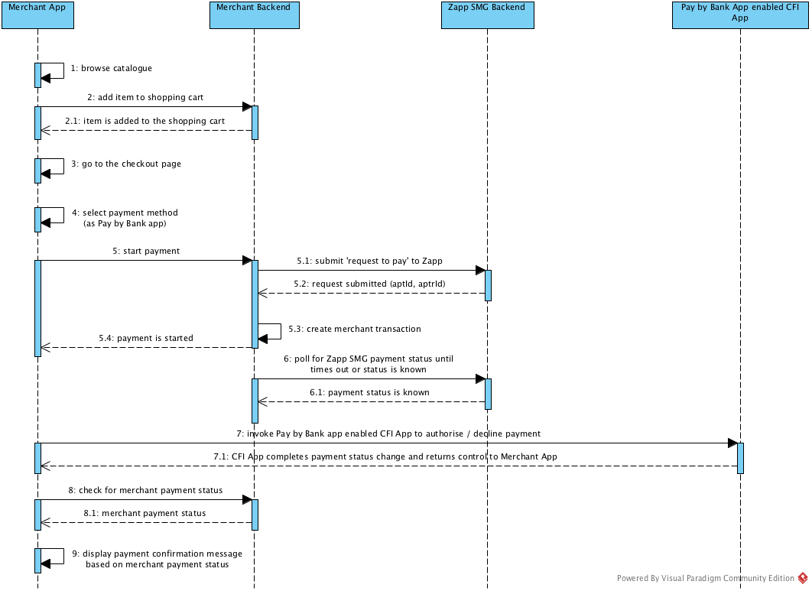
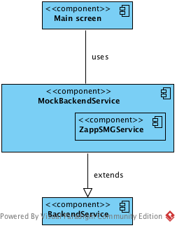
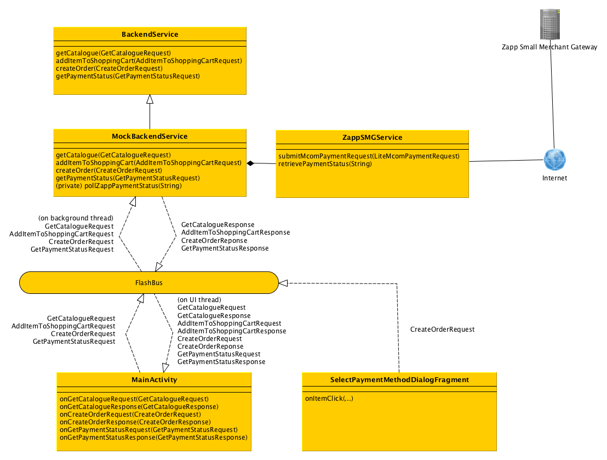

# Zapp Small Merchant Gateway Mcom Demo App Documentation

## Introduction

This documentation provides a description about a demo App which is using the Zapp Small Merchant Library to perform an mcom journey on Android platform.

The mcom journey is a four player journey which involves the Merchant App, the Pay by Bank app enabled CFI App, the Merchant Backend and the
Zapp Small Merchant Gateway Backend.

A sample user journey includes the following steps:

* The user browses the catalogue of the Merchant App
* The user adds one or more items to the shopping cart
* The user taps the button which displays the checkout page of the Merchant App
* The user select a payment method and taps the button which starts the payment
* If the payment has been completed, the Merchant App displays the payment confirmation page

## The Zapp Small Merchant Gateway mcom user journey from technical point of view

The following sequence diagram shows the interaction sequence between the components of the mcom journey.

.

.

Once the user has put all the items to be purchased to the shopping card, has moved to the checkout page and selected Pay by Bank app as payment method, the
technical steps of the mcom 'happy path' journey are as follows:

* The Merchant App sends a 'create order' request to the Merchant Backend to start the payment
* The Merchant Backend sends a 'request to pay' request to the Zapp Small Merchant Gateway
* The Zapp Small Merchant Gateway returns the Zapp transaction details to the Merchant Backend (in response to the 'request to pay' request)
* The Merchant Backend creates a merchant transaction with a unique ID and starts polling the Zapp Smart Merchant Gateway for the payment
status of the Zapp payment (using the Zapp transaction aptrId value)
* The Merchant Backend returns the merchant transaction details and the Zapp transaction details to the Merchant App (in response to the 'create order' request)
* The Merchant App invokes the Pay By Bank app enabled CFI App using the Zapp Small Merchant Gateway library (providing the aptId and aptrId of the Zapp transaction)
* The CFI App takes over, retrieves and displays the Zapp transaction details to the customer who authorises or declines it
* The CFI App updates the payment status in Zapp based on the user's choice then invokes back to the Merchant App with the value of the merchantCallbackUrl (appended by the aptrId as query parameter)
* The Merchant App sends a 'get payment status' request to the Merchant Backend (which was polling for the Zapp transaction status in the meantime)
* The Merchant Backend sends the Merchant transaction status to the Merchant App (in response to the 'get payment status' request)
* The Merchant App displays the payment confirmation page (depending on the transaction status)

## Movie Store (The Zapp Small Merchant Gateway mcom sample App)

This repo contains the source code of a sample mcom demo App which implements the steps described in the previous list with the help of the Zapp Small Merchant Gateway Library.
The App builds on top of the Library however it uses only a small part of it (mainly the utility class to invoke to the Pay by Bank app enabled CFI App and check if there
is any such App installed on the device, and assets / resources in order to be able to display a Pay by Bank app payment option in its payment method selection dialog).

### The App source code structure

* com.zapp.smg.moviestore - Application and MainActivity classes
* * mock.service - mock classes of the Merchant Backend
* * * zapp.smg - proxy for the mock to the Zapp Small Merchant Gateway Backend
* * model - model classes for the sample App
* * * backend - Merchant Backend request and response model classes
* * service - Merchant Backend classes
* * ui - UI classes

The app has a single [MainActivity](app/src/main/java/com/zapp/smg/moviestore/MainActivity.java) which renders the main screen of the App with the movie catalogue. This
Activity is responsible for all the UI related logic (e.g. opening the [SelectPaymentMethodDialogFragment](app/src/main/java/com/zapp/smg/moviestore/ui/SelectPaymentMethodDialogFragment.java)
, [PaymentConfirmationDialogFragment](app/src/main/java/com/zapp/smg/moviestore/ui/PaymentConfirmationDialogFragment.java) and executing requests to the backend service.

The [MockBackendService](app/src/main/java/com/zapp/smg/moviestore/mock/service/MockBackendService.java) - [BackendService](app/src/main/java/com/zapp/smg/moviestore/service/BackendService.java)
 - [ZappSMGService](app/src/main/java/com/zapp/smg/moviestore/mock/service/zapp/smg/ZappSMGService.java) service classes are initialised in the
 [Application](app/src/main/java/com/zapp/smg/moviestore/Application.java) class which keeps reference to them and provide the application context.

Both the backend service (its mock too) and the UI activity registers to the FlashBus default instance automatically, this is how they connect to each others. They send /
 receive events through the FlashBus interface for which they deliver the required information, wrapped into backend event classes (see the com.zapp.smg.moviestore.model.backend package).

### Mocked Merchant Backend

**Note**: for the sake of simplicity, this demo app
does not have a separate Merchant Backend (e.g. a cloud server providing merchant backend API to the Merchant App). The Merchant Backend service is included in the App
source code and implemented as follows:

* The [BackendService](app/src/main/java/com/zapp/smg/moviestore/service/BackendService.java) class provides the Merchant Backend API interface.
* This interface is mocked with the [MockBackendService](app/src/main/java/com/zapp/smg/moviestore/mock/service/MockBackendService.java) class which acts as a real
Merchant Backend. It responds to the Merchant Backend API calls with mocked responses, submits the 'request to pay' request to the real Zapp Small Merchant Gateway backend and polls for the
Zapp transaction status in the background, exactly as it is described in the mcom 'happy path' journey steps so when the control goes over to the Pay by Bank app enabled
CFI App, it will be able to retrieve the Zapp payment details and authorise / decline the payment which status gets reflected in the Merchant Backend.

The following component diagram shows the component structure of the Merchant Backend Service, the Mocked Merchant Backend Service  and the main screen.

.

.

### App architecture

The App architecture is built around the FlashBus event bus library. The backend service classes are fully decoupled from the UI classes through an event interface. The
FlashBus library delivers the events between the components and switches between the UI and background threads where it is necessary. The events are delivered on the
 background thread to all service classes (MockBackendService and BackendService) and are delivered on the UI thread to the MainActivity class which is responsible
 for the UI rendering.

The following image presents the important classes of the App and their event interfaces.

.

.

# What's next?

After reading the documentation of the sample mcom App, as a next step, please move on to read the documentation of the Zapp Small Merchant Gateway Library [here](library).
